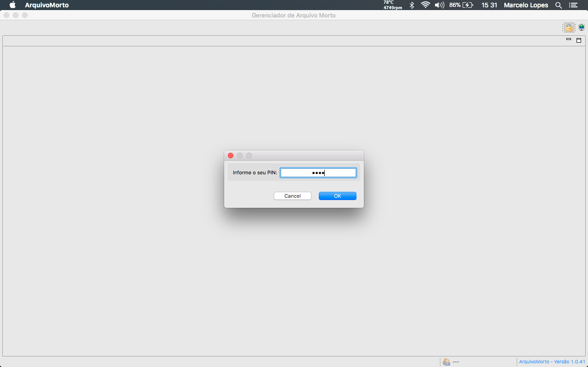

# ArquivoMorto

<<<<<<< HEAD
**Aplicação começando a tomar forma...**
=======
*** Aplicação começando a tomar forma... ***
>>>>>>> c38ce9df7201fad5aa3ef52a3f4736897856b219

**Após quarto dia de desenvolvimento...**

Implementada sistemática de autenticação de usuários. Como não é um sistema crítico em termos de segurança onde há a exigência de um controle mais rigoroso de acesso, optou-se por utilizar uma tela que captura apenas a senha (que deve ser única) e por intermédio dela é identificado o usuário. O objetivo é tornar ágil o ato de autenticação. 

